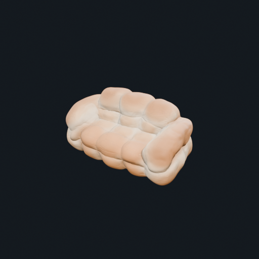

English | <a href="README_zh-CN.md">简体中文</a>

<h2 align="center">BlenderLore: Learning 3D Coding from Internet Tutorial Videos</h2>

<p align="center">
  <strong>If you like our project, please give us a star ⭐ on GitHub for the latest update.
</strong>
</p>

<p align="center">
  <a href="https://blenderlore.github.io/"></a>
  <a href="https://github.com/FreedomIntelligence/BlenderLore"></a>
  <a href="https://huggingface.co/"></a>
  
</p>

## 🎬 Showcases

<table style="width:100%; border-collapse: collapse; margin: 20px 0;">
  <tr>
    <th colspan="4" align="left" style="padding: 10px; background-color: #f6f8fa;">Generation · Material</th>
  </tr>
  <tr>
    <td align="center" style="padding: 10px;">
      <video src="https://github.com/user-attachments/assets/623cfa2d-633f-45b4-b85f-c8c410ed9e6a" controls style="width:100%"></video>
      <br><strong>Black Wukong</strong>
    </td>
    <td align="center" style="padding: 10px;">
      <video src="https://github.com/user-attachments/assets/c3874ee6-c43f-4829-933c-825e208b4975" controls style="width:100%"></video>
      <br><strong>Gold Foil Card</strong>
    </td>
    <td align="center" style="padding: 10px;">
      <video src="https://github.com/user-attachments/assets/eb9c10f5-c372-470e-b4c8-a724ab13a37e" controls style="width:100%"></video>
      <br><strong>Laser Card</strong>
    </td>
    <td align="center" style="padding: 10px;">
      <video src="https://github.com/user-attachments/assets/81699ce8-0624-4dab-b71b-453b1dd88863" controls style="width:100%"></video>
      <br><strong>Procedural Fur Ball</strong>
    </td>
  </tr>
  <tr>
    <th colspan="4" align="left" style="padding: 10px; background-color: #f6f8fa;">Generation · Objects</th>
  </tr>
  <tr>
    <td align="center" style="padding: 10px;">
      <video src="https://github.com/user-attachments/assets/6539c231-3871-4ebb-b781-e2cd77151ddd" controls style="width:100%"></video>
      <br><strong>Bear Ice Zongzi</strong>
    </td>
    <td align="center" style="padding: 10px;">
      <video src="https://github.com/user-attachments/assets/f035e0f0-77b2-429b-8938-7a18e3538835" controls style="width:100%"></video>
      <br><strong>Bee Keycap</strong>
    </td>
    <td align="center" style="padding: 10px;">
      <video src="https://github.com/user-attachments/assets/d6544245-9df2-49a9-a9bb-0b66d98fe22e" controls style="width:100%"></video>
      <br><strong>Bow</strong>
    </td>
    <td align="center" style="padding: 10px;">
      <video src="https://github.com/user-attachments/assets/a497de59-bd2c-4efe-bde2-c3d2cb9f62ee" controls style="width:100%"></video>
      <br><strong>Tulip</strong>
    </td>
  </tr>
  <tr>
    <th colspan="4" align="left" style="padding: 10px; background-color: #f6f8fa;">Editing · Duck Gigi</th>
  </tr>
  <tr>
    <td align="center" style="padding: 10px;">
      <video src="https://github.com/user-attachments/assets/22805e1e-bac4-4012-84eb-ccb04ca6d2b3" controls style="width:100%"></video>
      <br><strong>Duck Gigi</strong>
    </td>
    <td align="center" style="padding: 10px;">
      <video src="https://github.com/user-attachments/assets/65a63214-6569-4e9c-8429-6e5ffbc9fae4" controls style="width:100%"></video>
      <br><strong>Change 1</strong>
    </td>
    <td align="center" style="padding: 10px;">
      <video src="https://github.com/user-attachments/assets/18fa7d90-b628-4133-ae6a-192184483690" controls style="width:100%"></video>
      <br><strong>Change 2</strong>
    </td>
    <td align="center" style="padding: 10px;">
      <video src="https://github.com/user-attachments/assets/bbced62c-abd3-464b-a61e-4abc98f3fb97" controls style="width:100%"></video>
      <br><strong>Change 3</strong>
    </td>
  </tr>
  <tr>
    <th colspan="4" align="left" style="padding: 10px; background-color: #f6f8fa;">Editing · Glass Heart Material Transfer</th>
  </tr>
  <tr>
    <td align="center" style="padding: 10px;">
      <video src="https://github.com/user-attachments/assets/222ced56-5d79-4e8b-8133-792dbb3fecca" controls style="width:100%"></video>
      <br><strong>Glass Heart</strong>
    </td>
    <td align="center" style="padding: 10px;">
      <video src="https://github.com/user-attachments/assets/9d84de38-6773-4dde-9291-36bed31a5487" controls style="width:100%"></video>
      <br><strong>Female Bust</strong>
    </td>
    <td align="center" style="padding: 10px;">
      <video src="https://github.com/user-attachments/assets/ade45110-694c-4f9a-8dd6-5b08b28960fc" controls style="width:100%"></video>
      <br><strong>Frog Traveler</strong>
    </td>
    <td align="center" style="padding: 10px;">
      <video src="https://github.com/user-attachments/assets/a55a5f3c-6841-4eb1-8e62-6623c3854fe7" controls style="width:100%"></video>
      <br><strong>Vintage Racing Car</strong>
    </td>
  </tr>
  <tr>
    <th colspan="4" align="left" style="padding: 10px; background-color: #f6f8fa;">Editing · Sofa</th>
  </tr>
  <tr>
    <td align="center" style="padding: 10px;">
      
      <br><strong>Sofa</strong>
    </td>
    <td align="center" style="padding: 10px;">
      
      <br><strong>Change 1</strong>
    </td>
    <td align="center" style="padding: 10px;">
      
      <br><strong>Change 2</strong>
    </td>
    <td align="center" style="padding: 10px;">
      
      <br><strong>Change 3</strong>
    </td>
  </tr>
</table>


## 🔭 Overview

Internet Blender tutorials contain rich, real-world creation knowledge, but that knowledge is difficult for an agent to use directly. Important instructions may appear in narration, on-screen captions, changing interface states, or brief node-graph operations. BlenderLore converts tutorial videos into timestamped multimodal evidence, reconstructs the demonstrated workflow, and generates executable Blender Python. Each run delivers an editable Blender project, a reproduction script, renders, and validation results.

**Generalization is central to BlenderLore**. Successful reconstructions are retained as candidate procedural knowledge. When facing an unfamiliar generation or editing task, the agent decomposes the target into reusable construction patterns, retrieves relevant procedural knowledge, and recombines it into task-specific Blender code.

## 🧩 Method


1. **Collect tutorials** — select a high-quality Blender tutorial and define the target asset or supported motion.
2. **Recover evidence** — align visual keyframes, OCR, narration, timestamps, interface actions, and Blender-version cues.
3. **Specify the workflow** — convert the evidence into ordered operations and retrieve relevant procedural knowledge.
4. **Code, run, and repair** — generate Blender Python, execute it, render the scene, compare the result, and repair failures.
5. **Verify and retain** — package editable assets and visual evidence, then retain validated patterns for future tasks.

## 🎁 What You Get

<table>
<tr>
<td width="33%" valign="top">

### 01 · An End-to-End Agent Pipeline

Each run recreates a tutorial workflow and delivers an editable Blender project, a reproduction script, renders, and validation results.

- Editable Asset — `asset.blend`
- Reproduction Script — `reproduce.py`
- Materials & Node Graphs
- Final Render
- Multi-View Renders
- Animation
- Agent Log

</td>
<td width="33%" valign="top">

### 02 · A High-Quality 3D Dataset

Through collection, repair, and reconstruction, we built a high-quality dataset of 23K procedural 3D assets.

</td>
<td width="33%" valign="top">

### 03 · A Reusable Procedural Knowledge Library

Successful workflows are retained as reusable procedural knowledge. For unfamiliar targets, the agent decomposes the task, retrieves relevant patterns, and recombines them into task-specific Blender code.

</td>
</tr>
</table>

## 🚀 Quick Start

### 1. Install prerequisites

Install Python 3.10+, Blender, and FFmpeg (including `ffprobe`), with Blender and FFmpeg on `PATH`. Commands below target macOS/Linux; on Windows, use Linux Python and Blender in WSL. Replace example paths with your own.

```bash
git clone https://github.com/FreedomIntelligence/BlenderLore.git
cd BlenderLore
python3 -m venv .venv
source .venv/bin/activate
python -m pip install -r requirements.txt
```

For Codex, install and sign in to Codex CLI using the [official documentation](https://developers.openai.com/codex/cli/), and ensure the client can run `codex`.

### 2. Install Skills

Run from the repository root to install the Skill into the current user's Codex environment:

```bash
mkdir -p "$HOME/.agents/skills"
ln -s "$PWD/skills/blender-pipeline" "$HOME/.agents/skills/blender-pipeline"
```

### 3. Configure rendering

Cycles uses the CPU by default. Omit the Blender path setting if Blender is already on `PATH`.

```bash
export BLENDER_PIPELINE_BLENDER=/path/to/blender
export VIDEO2BLENDER_CYCLES_BACKEND=CPU
```

For GPU rendering, replace `CPU` with the appropriate backend: `OPTIX` or `CUDA` for NVIDIA, `METAL` for Apple Silicon, `HIP` for AMD, or `ONEAPI` for Intel.

### 4. Configure inputs and outputs

Keep input files on your computer. For API mode, enter their paths in the terminal launch command in step 5; for Codex, provide paths or links directly in the client's chat composer.

| Input | API argument | Provide in Codex |
| --- | --- | --- |
| Local video | `--video-file` | Absolute path to the video |
| Video URL | `--video-url` | Full HTTPS video URL |
| Markdown tutorial | `--tutorial` | Absolute path to the `.md` file |

Markdown tutorials need numbered operations and their referenced images. Text-only tutorials also require a final reference image.

Choose a new or empty output directory outside the repository: use `--output-dir` in API mode, or specify it in the Codex conversation. Output formats are fixed; main files appear as their corresponding stages complete:

```text
run_001/
  tutorial.md             # Illustrated tutorial
  reproduce.py            # Blender Python code
  asset.blend             # Editable project
  render.png              # Rendered image
  six_views/              # Static multi-view renders, when applicable
  final_effect.mp4        # Animation or turntable video, when applicable
  pipeline_review.json    # Review results
```

### 5. Start with API / Codex

#### API

Open a terminal at the repository root and run this command for first-time setup:

```bash
python run_api.py --configure --config "$HOME/.config/blender-pipeline/pipeline.json"
```

At the terminal prompts, enter an HTTPS API endpoint ending in `/chat/completions` and your API key. The endpoint is saved in the `endpoint` field of `~/.config/blender-pipeline/pipeline.json`; the key is saved in `model_api_key` in the same directory. Edit these files to change the configuration later.

Launch from the same terminal, replacing the input path and output directory with your own. Use the corresponding argument from step 4 for other input types:

```bash
python run_api.py --config "$HOME/.config/blender-pipeline/pipeline.json" \
  --video-file /path/to/input/tutorial.mp4 --output-dir /path/to/data/run_api
```

For a tutorial with a starting project, append `--asset /path/to/starter.blend`; for a text-only tutorial, append `--target-image /path/to/target.png`.

#### Codex

Type `/blender-pipeline` in the chat composer:

```text
/blender-pipeline
Input: /path/to/input/tutorial.mp4
Output: /path/to/data/run_skill
```

You can replace the input with a full video URL or a Markdown tutorial path. Include paths to any supporting project or reference images in the same message.

## 📖 Citation

```bibtex
@misc{blenderlore2026,
  title        = {BlenderLore: Learning 3D Coding from Internet Tutorial Videos},
  author       = {FreedomAI Team},
  year         = {2026},
  publisher    = {GitHub},
  journal      = {GitHub repository},
  howpublished = {\url{https://github.com/FreedomIntelligence/BlenderLore}},
}
```

## 🙏 Acknowledgements

This project is built upon [Blender](https://www.blender.org/), the free and open-source 3D creation suite.

## 📄 License

This project is released under the Apache 2.0 license.

## 📬 Contact

For questions and feedback, please contact us at: <a href="mailto:minghaowu@link.cuhk.edu.cn">minghaowu@link.cuhk.edu.cn</a>
